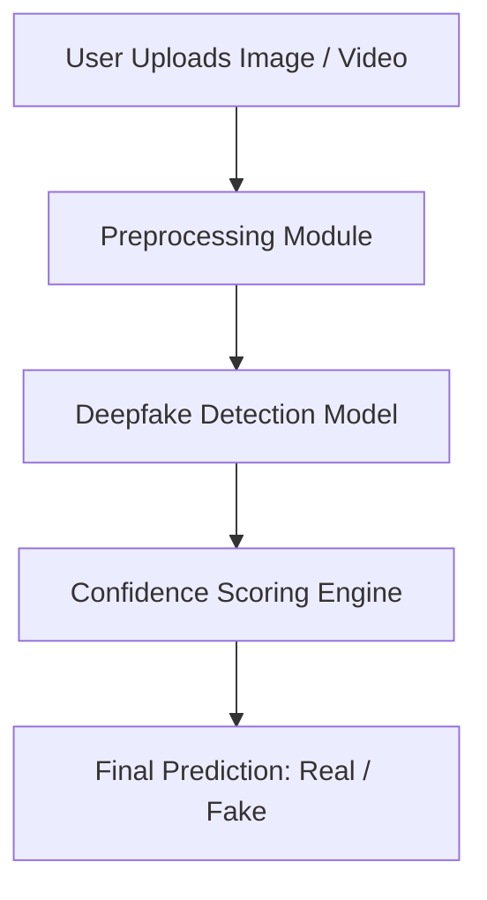

<p align="center">
  
  
  
</p>


<p align="center">
  
  
</p>

<p align="center">
  
</p>

<p align="center">
  <b>AI‑Powered System to Detect Deepfake Images & Videos</b><br/>
  Preventing misinformation, fraud, and digital manipulation
</p>

# 🛡️ Truth Seeker (DeepGuard)

**Truth Seeker (DeepGuard)** is an AI-powered system designed to detect deepfake images and videos with high accuracy.  
It helps prevent misinformation, fraud, identity misuse, and digital manipulation across social media and online platforms.

---

## 🚨 Problem Statement

Deepfake images and videos generated using AI are rapidly spreading on social media.  
These fake contents are used to spread misinformation, damage reputations, commit fraud, and manipulate public opinion.

---

## 🧠 Solution Overview

Truth Seeker uses **deep learning models** to analyze images and videos and classify them as **Real or Fake**, along with a confidence score.  
The system is optimized for **accuracy, performance, and scalability**.

---

## 🏗️ System Architecture


---

 ## Key Features
🔍 AI-based deepfake image & video detection

⚡ High-performance optimized models

📊 Confidence score with predictions

🔐 Secure & privacy-focused processing

📈 Scalable architecture for future upgrades

---

## 🧰 Tech Stack

### 🌐 Frontend
- **HTML, CSS, JavaScript**
- **React** (UI Framework)

---

### ⚙️ Backend
- **Python**
- **FastAPI / Flask**

---

### 🤖 AI / Machine Learning
- **CNN & Transformer‑based Models**
- **OpenCV**
- **PyTorch / TensorFlow**

---

### 🔐 Authentication (Google)
- **Firebase Authentication**
  - Email & Password based login
  - Secure user access control

---

### ⚡ Optimization
  - Faster inference
  - Optimized CPU performance

---

### 🚀 Deployment
- **Vercel**
- **Docker**

---

## 🚀 Getting Started
Prerequisites
Python 3.9+

pip

Clone repository
```bash
git clone https://github.com/Khushal-93/truth-seeker.git
cd truth-seeker
```

## Backend setup
```bash
pip install -r requirements_server.txt
python server.py
```

## Frontend setup
```
npm install
npm run dev
```

## Run the Project
```
python server.py
```

---

## 📂 Project Structure
```bash
truth-seeker/
├── public/
├── src/
├── video_deepfake/
├── server.py
├── requirements_server.txt
├── README.md
```

---

## 📊 Project Status

✔ Image Deepfake Detection

✔ Video Deepfake Detection

🔄 Model Accuracy Improvements (Ongoing)

---

## 👥 Team 

 Name | Role |
|-----|-----|
| Khushal Choudhary | Frontend & UI |
| Tushar kumar | AI Model & Integration |
| Pushkar Shinde | Backend & APIs |
| Ruchita Naik | PPT and coordination |

---

## 🤝 Contributing

Contributions are welcome and appreciated!  
If you have ideas to improve **Truth Seeker / DeepGuard**, feel free to contribute.

### How to Contribute
1. Fork this repository
2. Create a new branch (`git checkout -b feature-name`)
3. Make your changes
4. Commit your changes (`git commit -m "Add feature"`)
5. Push to your branch (`git push origin feature-name`)
6. Open a Pull Request

Please ensure your code follows the project structure and does not break existing functionality.

---

## 📜 License
This project is licensed under the MIT License.
See the [LICENSE](./LICENSE) file for details.


